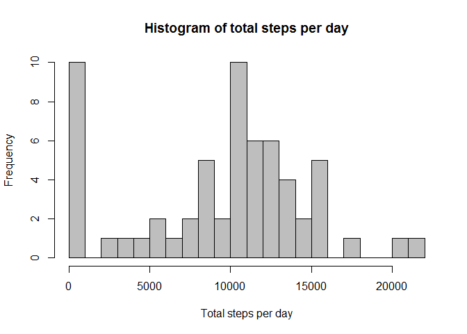
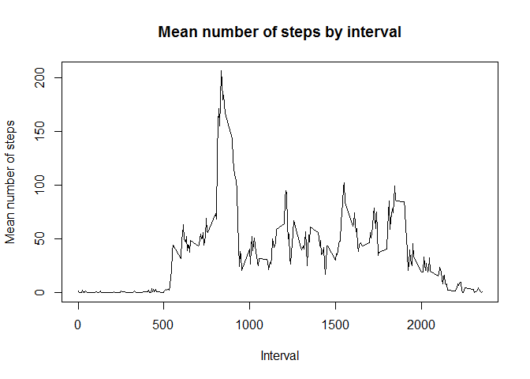
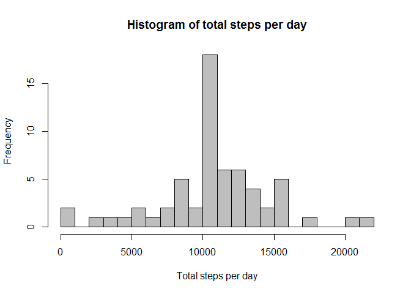

# Reproducible Research: Peer Assessment 1

### Loading and preprocessing the data

1. Load the data from 'activity.csv'


```r
# read data into a data frame
df <- read.csv('activity.csv')
```

### What is the mean total number of steps taken per day?

For this part of the assignment, we will ignore the missing values in the dataset (`na.rm=TRUE`).


```r
# load dplyr for data wrangling
library(dplyr)
```

```
## 
## Attaching package: 'dplyr'
```

```
## The following objects are masked from 'package:stats':
## 
##     filter, lag
```

```
## The following objects are masked from 'package:base':
## 
##     intersect, setdiff, setequal, union
```

```r
# summarize data by total steps per day (i.e. per date)
steps_per_day <- df %>%
  group_by(date) %>%
  summarize(total=sum(steps, na.rm=TRUE))
```

1. Make a histogram of the total number of steps taken each day


```r
# histogram of total number of steps per day
hist(steps_per_day$total, breaks=25, col='grey',
  xlab='Total steps per day', ylab='Frequency', main='Histogram of total steps per day')
```



2. Calculate and report the **mean** and **median** total number of steps taken per day


```r
# mean and median number of steps per day
mean(steps_per_day$total, na.rm=TRUE)
```

```
## [1] 9354.23
```

```r
median(steps_per_day$total, na.rm=TRUE)
```

```
## [1] 10395
```

### What is the average daily activity pattern?

1. Make a time series plot (i.e. `type = "l"`) of the 5-minute interval (x-axis) and the average number of steps taken, averaged across all days (y-axis)


```r
# summarize the data by interval
daily_activity <- df %>%
  group_by(interval) %>%
  summarize(mean.steps=mean(steps, na.rm=TRUE))

# time series plot of mean number of steps (y-axis) vs interval (x-axis)
with(daily_activity,
  plot(mean.steps ~ interval, type='l',
    xlab='Interval', ylab='Mean number of steps', main='Mean number of steps by interval'))
```



2. Which 5-minute interval, on average across all the days in the dataset, contains the maximum number of steps?


```r
# interval with max average number of steps
daily_activity[which.max(daily_activity$mean.steps),]
```

```
## Source: local data frame [1 x 2]
## 
##   interval mean.steps
##      (int)      (dbl)
## 1      835   206.1698
```

So interval **835** has the max average number of steps.

### Imputing missing values

Note that there are a number of days/intervals where there are missing
values (coded as `NA`). The presence of missing days may introduce
bias into some calculations or summaries of the data.

1. Calculate and report the total number of missing values in the dataset (i.e. the total number of rows with `NA`)


```r
# number of rows with missing values
sum(is.na(df$steps))
```

```
## [1] 2304
```

2. Devise a strategy for filling in all of the missing values in the dataset. The strategy does not need to be sophisticated. For example, you could use the mean/median for that day, or the mean for that 5-minute interval, etc.

Strategy: we will replace each missing value with the mean for its corresponding 5-minute interval


```r
# a (vectorized) helper function that takes an interval and returns its mean number of steps
mean_steps_of_interval <- function(input_interval) {
  daily_activity$mean.steps[match(input_interval, daily_activity$interval)]
}
```

3. Create a new dataset that is equal to the original dataset but with the missing data filled in.


```r
# new dataset
df_new <- df

# fill in each missing `df$steps` value with the mean of its corresponding 5-minute interval
na_index <- is.na(df_new$steps)
df_new$steps[na_index] <- mean_steps_of_interval(df_new$interval[na_index])
```

4. Make a histogram of the total number of steps taken each day and Calculate and report the **mean** and **median** total number of steps taken per day. Do these values differ from the estimates from the first part of the assignment? What is the impact of imputing missing data on the estimates of the total daily number of steps?


```r
# df_new summary by total steps per day (i.e. per date)
steps_per_day <- df_new %>%
  group_by(date) %>%
  summarize(total=sum(steps))

# df_new histogram of total number of steps per day
hist(steps_per_day$total, breaks=25,  col='grey',
  xlab='Total steps per day', ylab='Frequency', main='Histogram of total steps per day')
```



```r
# df_new mean and median number of steps per day
mean(steps_per_day$total)
```

```
## [1] 10766.19
```

```r
median(steps_per_day$total)
```

```
## [1] 10766.19
```

The histogram shows an almost doubling of the number of data points around the mean.  But the mean and median values did not change.  This is the case because our strategy for filling in missing data was to add additional data points with values equal to the mean of the corresponding intervals, and the mean and median in this case are practically equal.  So the impact of imputing missing data is minimal, at least when measured by the mean and median values.

### Are there differences in activity patterns between weekdays and weekends?

For this part the `weekdays()` function may be of some help here. Use
the dataset with the filled-in missing values for this part.

1. Create a new factor variable in the dataset with two levels -- "weekday" and "weekend" indicating whether a given date is a weekday or weekend day.


```r
df_new$date <- as.Date(df_new$date, format='%Y-%m-%d')
df_new$day.of.week <-
  factor((weekdays(df_new$date, abbreviate=TRUE) %in% c('Mon', 'Tue', 'Wed', 'Thu', 'Fri')), 
         levels=c(TRUE, FALSE), labels=c('weekday', 'weekend'))
```

1. Make a panel plot containing a time series plot (i.e. `type = "l"`) of the 5-minute interval (x-axis) and the average number of steps taken, averaged across all weekday days or weekend days (y-axis). The plot should look something like the following, which was created using **simulated data**:


```r
# summarize the data by interval
daily_activity <- df_new %>%
  group_by(day.of.week, interval) %>%
  summarize(mean.steps=mean(steps))

# plot using lattice
library(lattice)
xyplot(mean.steps ~ interval | day.of.week, data=daily_activity,
  layout=c(1,2), type='l', xlab='Interval', ylab='Mean number of steps')
```


